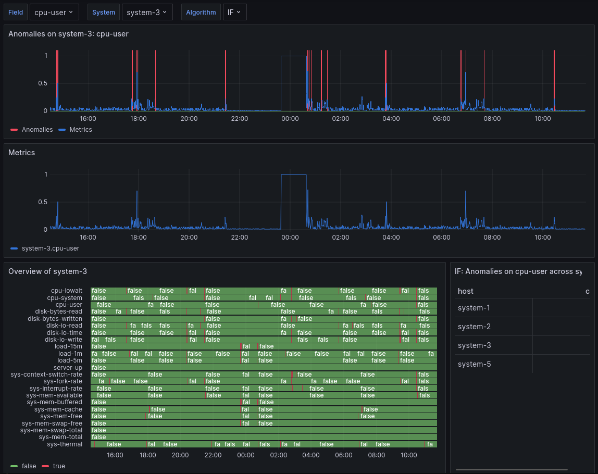

#  PDC-MAD - Performance Data Collection, Monitoring and Anomaly Detection
<div align="center">
    </img>
</div>

## Description
PDC-MAD is a project that will help future development of anomaly detection algorithms for test server data by simulating "normal" data with the ability to inject anomalous data. With the built in anomaly detection module you can trigger any self-defined anomaly detection algorithms. Both simulated and anomaly data are stored in [InfluxDB](#services) and visualized as graphs with [Grafana](#services).

It can either simulate in real-time or in batches. 


## Overview
This project consists of two main parts, the Simba CLI tool and the backend docker stack.

### Simba
Simba is a CLI tool that can be used to simulate data and inject anomalies. It uses CSV files as input and outputs data to InfluxDB. The format of the CSV files are defined in the [Dataset](#dataset) section. It is not a part of the docker stack but can be built and installed as a standalone binary, see [Simba](#installing) for more information. 

### Docker stack
The PDC-MAD stack consists of a few services. You can find these in the `docker-compose.yml` file. The services are:
#### InfluxDB
Accessed with (by default) `localhost:8086` you can log in and administer users, buckets and also test queries when developing further. The container will mount a volume to the host machine so that data is persisted between restarts. The location of this volume can be changed in the `docker-compose.yml` file.

#### Grafana
The docker stack comes with preset datapoints and dashboards that you can use or otherwise set up your own inside of Grafana. Access to the service is by default `localhost:3000`. This container will also mount a volume which can be changed in the `docker-compose.yml` file. The `dashboards` and `provisioning` directories contain the pre-made dashboards and data sources. These are mounted to the Grafana container and will be loaded on startup.

#### Nala
A RestAPI that handles communication between anomaly detection algorithms and a database. The default port is `8088`. Use any HTTP client to send requests to the API (such as curl). Though Nala is a service inside the docker stack it can be built and run as a standalone program, though this is not documented/officially supported.

### Dataset
For both Nala and Simba we use Westermo's [test-system-performance-dataset](https://github.com/westermo/test-system-performance-dataset) data structure. Follow the link to get more info on all the metrics.

## Getting Started
### Dependencies

- [Docker](https://docs.docker.com/get-docker/): The backend is built with docker and docker-compose. 
- [Go 1.20](https://go.dev/doc/install): In order to run Simba and Nala as a standalone. Package dependencies are defined in the go.mod files for each module.

- [Python](https://www.python.org/downloads/): Our anomaly detection algorithm is written in Python. It requires certain packages to be installed. See [requirements.txt](/nala/anomaly_detection/requirements.txt) for specifics. These are installed automatically when building the Nala docker image.

### Installing
This program should work on Windows 10 and 11 but only Linux is officially supported. This documentation will assume that you are using Linux.

#### Pre-requisites
Clone PDC-MAD repository to desired location. Before deploying the containers you need to define the environment variables for the docker stack by creating a `.env` file int the same directory as the `docker-compose.yml` file. The `.env.example` file contains all the variables that are needed, we recommend copying this file and changing the values to your liking. They are further explained in the [Environment Variables](#environment-variables) section.

#### Docker stack
First step is to build nala. This needs to be done from the repository root folder because of shared dependencies. Use the following command to build the image:
```shell
docker build --tag nala -f nala/Dockerfile .
```
This will take a few minutes depending on hardware. 

When the image is built you can deploy the stack. In the docker folder run:
```shell
docker compose up
```

#### Simba
You can either run or install Simba, we would recommend installing it. While in the simba folder.
```shell
go install .
```
In case of issues when installing the go program please read Go's [documentation](https://go.dev/doc/tutorial/compile-install), certain environment variables might need to be set.

#### Checking installation
Now everything should be set up. You can try if everything is properly installed and running with the checks below.

Grafana and InfluxDB is checked by going to a browser and see if the service is up. You can log in to both services with the default admin credentials. These are defined in the `.env` file.

Default InfluxDB:
`http://localhost:8086`

Default Grafana:
`http://localhost:3000`

Testing Simba is by running the installed `simba` command and getting help text.

Test that Nala is working by sending a request to the test endpoint with the following command:
```shell
curl localhost:8088/test
```

If all these commands works you have successfully installed PDC-MAD!

## Usage
### Simba
There are four base commands in Simba. These can be combined and used in different ways to fulfill more complex functionality.

Both `fill` and `stream` commands will use the filename without the extension as the system name. This is used to identify the system in the database. 

Every command needs the INFLUXDB_TOKEN environment variable to be set. This can be done by exporting it in the shell or by using the `--db-token` flag. See the Simba section of [Environment Variables](#environment-variables) for more information. See how to set up new InfluxDB tokens on the [InfluxDB](https://docs.influxdata.com/influxdb/cloud-serverless/admin/tokens/) documentation

You can also change a few other database settings with flags and environment variables. These are `--db-host`/`INFLUXDB_HOST`, `--db-port`/`INFLUXDB_PORT`, `--db-org`/`INFLUXDB_ORG`, `--db-bucket`/`INFLUXDB_BUCKET`. See the help text for each command for more information. If you are using the docker stack the default values should work.

#### Fill
Fill is used to batch-import CSV data to InfluxDB. The following flags are available:

-  `--anomaly value, -a value` Select which type of anomaly to use. Available: cpu-user-high, cpu-user-sin
- `--duration value, -d value` How long the simulation should run. Duration string.
- `--gap value, -g value` The time to leave between the last metric and now for future simulations.
- `--start-at value, -s value` How far into the file to start the simulation. Duration string.

Some examples:

Import all data in CSV file:
```shell
simba fill foo.csv
```

Import data from several CSV files:
```shell
simba fill foo1.csv foo2.csv foo3.csv
```

Import a specific duration of data (5 days in this case):
```shell
simba fill --duration 5d foo.csv
```
Start at specific time in the CSV file (3 days into the data in this case):
```shell
simba fill --start-at 3d --duration 1d foo.csv
```
Leave a gap at the end of the data for subsequent fill commands (the 2 most recent hours in this case):
```shell
simba fill --duration 5d --gap 2h foo.csv
```

The `--anomaly` flag can be used to inject anomalies into the data (by applying a function to the data). The supported anomalies can be found in the help text for the `fill` and `stream` commands. The following command will transform the metrics by applying a sine function to the `cpu-user` field:
```shell
simba fill --duration 1h --anomaly cpu-user-sin foo.csv
```
#### Stream
Stream is used to import data in "real-time" to InfluxDB, this is done by reading the CSV file line by line and sending it to the database. This is useful for testing anomaly detection algorithms in real-time. The same flags as for `fill` are available for `stream` with the exception of `--gap` and the addition of:
- `--append` Append to the latest metric with the same ID. If not set, the metric will be inserted using the current (wall) time. (default: false)
- `--time-multiplier value, -t value` Increase insertion speed by a factor of n. Must be >= 1. Extreme values may cause problems, user beware.

Some examples:

Start a real-time server simulation:
```shell
simba stream foo.csv
```
Append to existing data (requires the system to have previous data in the database):
```shell
simba stream --append foo.csv
```
Inject anomalies into the data:
```shell
simba stream --anomaly cpu-user-sin foo.csv
```
Start at specific time in the CSV file (3 days into the data in this case) and run for 25 minutes:
```shell
simba stream --start-at 3d --duration 25m foo.csv
```
Simulate at 20 times the speed (if the data has an interval of 30s the data will be inserted every 1s):
```shell
simba stream --time-multiplier 30 foo.csv
```
#### Clean
The clean command is used to remove data from the database, this is useful when you want to start over or remove old data. The following flags are available:

- `--all` Delete metrics from all the hosts of the bucket
- `--duration value, -d value` How far into the past to delete metrics.

Remove data from host `foo`
```shell
simba clean foo
```
Remove data for all host on specified [INFLUXDB_BUCKET](#environment-variables)
```shell
simba clean --all
```
Remove last hour of data
```shell
simba clean --duration 1h
```
Specify which measurement to clean, default is `metrics`. Use the following flag to remove anomalies:
```shell
simba clean --all -M anomalies
```
#### Example usage
As the append argument is not available for `fill` you have to shift the data with gap and calculate the next starting point and gap.

Simulate five days with one day of anomalous data
```shell
simba fill --duration 2d --gap 5d foo.csv
simba fill --start-at 2d --duration 1d --gap 3d --anomaly cpu-user-sin foo.csv
simba fill --start-at 2d --duration 2d foo.csv
```

Simulate 8h of data, then start real-time simulation with anomalies
```shell
simba fill --duration 8h foo.csv
simba stream --start-at 8h --append --anomalies cpu-user-high foo.csv
```

Simulate ten days of data taken from multiple datasets
```shell
simba fill --duration 2d --gap 10d foo1.csv
simba fill --start-at 2d --duration 1d --gap 3d --anomaly cpu-user-sin foo2.csv
simba fill --start-at 2d --duration 2d foo3.csv
```

### Nala
Nala is a RestAPI with a few built in commands. This could be hooked up to a web page or triggered by Bash scripts.

#### Endpoints
The following endpoints are available:

- `/trigger/[ALGORITHM]/[SYSTEM-NAME]/[DURATION]` to trigger an algorithm on a system for a duration.
- `/algorithms` to get a list of available algorithms.
Check status of detection:
- `/status` to get the status of the detection.
- `/test` to test that the API is working.

### Grafana
Grafana comes with predefined datapoints and dashboards that you can use on setup. The dashboard is structured mainly for anomaly detection testing and viewing.
<div align="center">
    </img>
</div>

>From top left to bottom right: Every panel only shows data for the selected time range.
#### Variables
In the top left there are dropdowns where you can select which field, system and algorithm you want to show data of.
#### Anomalies
The first panel is a combined query of anomalies and system metrics where each anomalous data point is represented with a red vertical line.
#### Metrics
Second panel consists of just the system metrics without any overlapping anomalies.
#### System overview
This state diagram provides a general overview of each anomaly found by algorithm on the system in a digestable manner.
#### Anomaly across systems
Last panel contains a table with the count of anomlies on selected field for each system with data.

## Environment Variables
### Docker
List of variables in the `.env` file:
- `INFLUXDB_ADMIN_USER` Admin username for InfluxDB.
- `INFLUXDB_ADMIN_PASSWORD` Admin password for InfluxDB.
- `INFLUXDB_ORG` InfluxDB predefined organization.
- `INFLUXDB_BUCKET` InfluxDB predefined bucket. This is where Simba will write and clean by default. Nala queries this bucket when getting the system data.
- `INFLUXDB_ADMIN_TOKEN` Token used for admins. This is what Nala uses when querying and writing data.
- `GRAFANA_ADMIN_USER` Admin username for Grafana
- `GRAFANA_ADMIN_PASSWORD` Admin password for Grafana
- `INFLUXDB_PORT` Default value of exposed port for InfluxDB
- `GRAFANA_PORT` Default value of exposed port for Grafana
- `NALA_PORT` Default value of exposed port for Nala

### Simba
Simba has some environment variables as well. Here is a list of them:
- `INFLUXDB_TOKEN` InfluxDB token - default: ***no default***.
- `INFLUXDB_HOST` InfluxDB host - default: ***localhost***.
- `INFLUXDB_PORT` InfluxDB port - default: ***8086***.
- `INFLUXDB_ORG` InfluxDB organization - default: ***pdc-mad***.
- `INFLUXDB_BUCKET` InfluxDB bucket - default: ***pdc-mad***.

## Help
Simba has help arguments (`-h`) for each command.
See [Nala's](#nala) documentation for general structure.
Both [InfluxDB](https://docs.influxdata.com) and [Grafana](https://grafana.com/docs/) have their own well-defined documentation.

## Authors
- [Meeptard](https://github.com/Meeptard)
- [Kurbitz](https://github.com/Kurbitz/)
- [Ni7070](https://github.com/Ni7070)
- [segerstorm](https://github.com/segerstorm)
- [FerDovah](https://github.com/FerDovah)
- [cenza1](https://github.com/cenza1)
